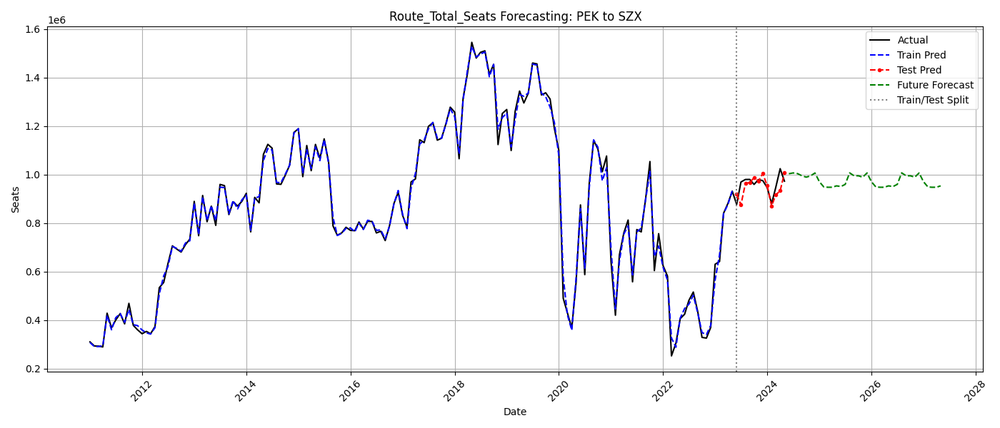
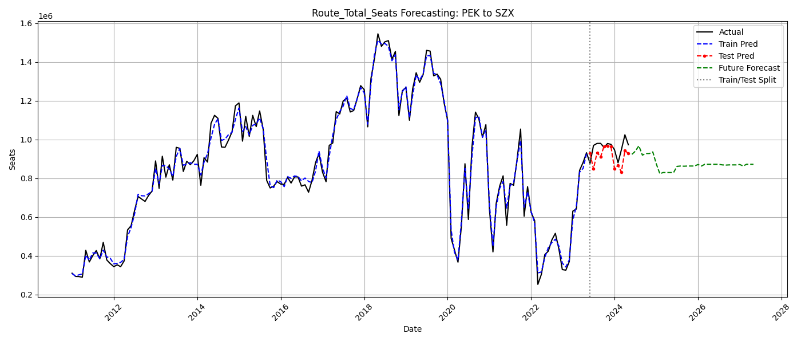
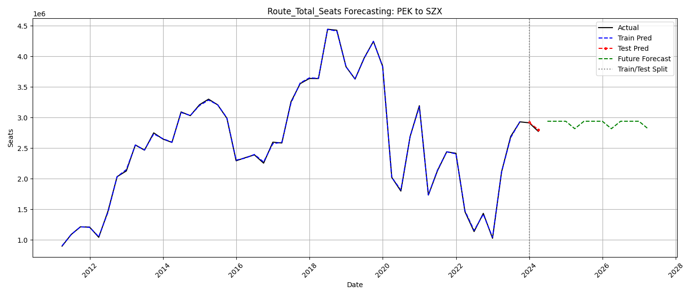
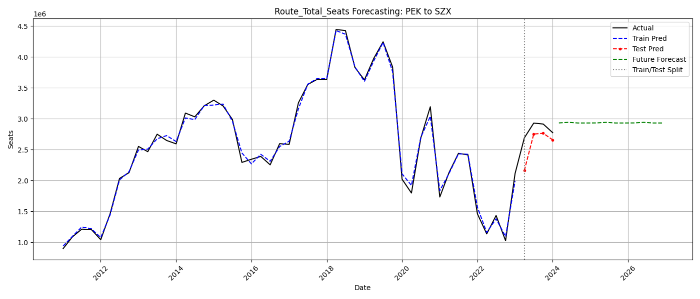
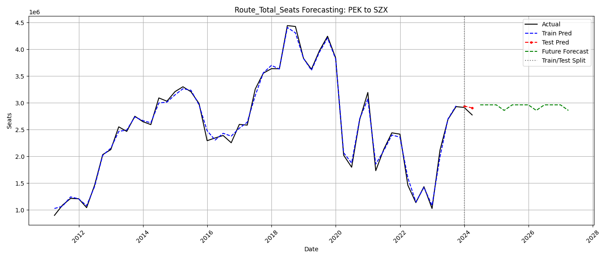
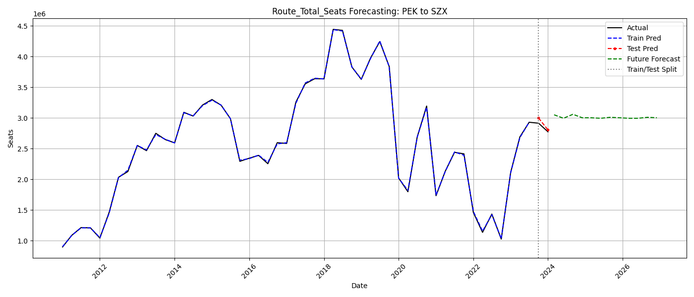
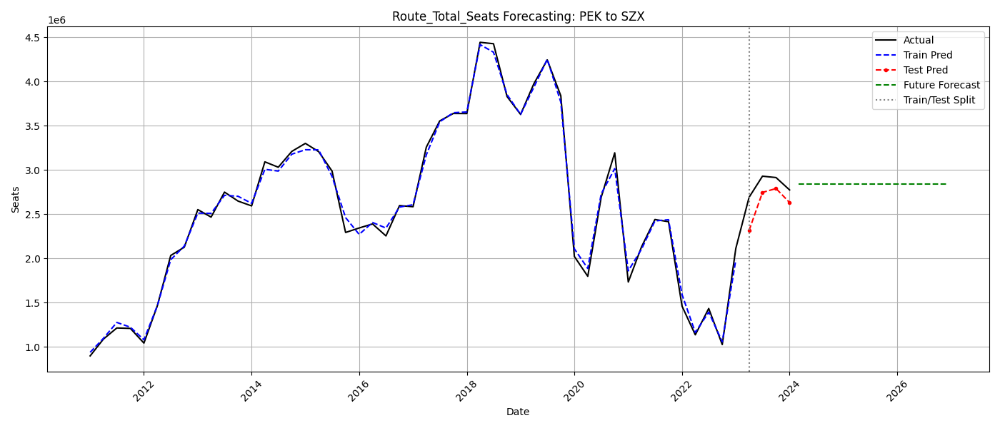
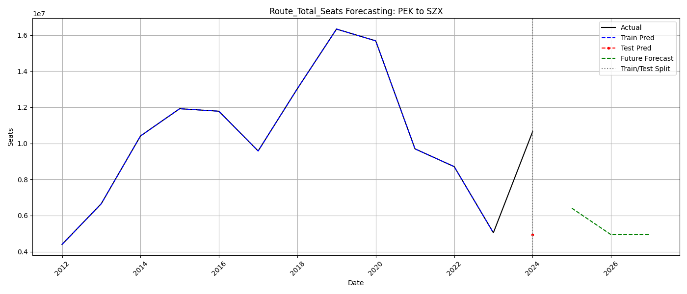
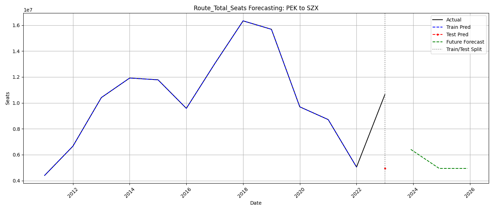

# 代码框架

1. `DataCleaner.py`文件是数据清洗，得到的是数据文件`final_data_0608.csv`，目前基本可以不动

2. `FeatureEngineer.py`文件中，

   `DataPreprocessor`是基本的数据预处理的特征工程类, 对于缺失值的填充方法可以修改本类；

   `FeatureBuilder`是额外的特征工程类,可以在此构造新的特征，为了预测和防止过拟合，不建议增加差分/窗口均值等与当前y值有关的特征；

   ` AirlineRouteModel`是数据管道类，输入出发和目标，就可以获得经过特征工程以后的训练集/测试集

3. `train_model.py`文件是最后的训练文件：

   可以修改model分布增加新的模型；

   可以修改预测部分，目前是简单外推。

4. `ts_model.py`文件是时间序列模型：

   若需要增加时间序列特征，可以增加模型或进行修改。

5. `time_granularity.py`文件可以选择本次模型训练的时间粒度。

6. `model_evaluation.py` 模型评估指标，现有指标如下：

   1. RMSE (Root Mean Square Error) - 均方根误差

      - **公式**：$\text{RMSE} = \sqrt{\frac{1}{n}\sum_{i=1}^{n}(y_i - \hat{y}_i)^2}$

      - **含义**：预测值与真实值偏差的平方和的平均值的平方根

      - **值域意义**：值越小越好（0表示完美预测）；对较大误差更敏感（平方效应）；单位与原始数据相同

   2. MAE (Mean Absolute Error) - 平均绝对误差

      - **公式**：$\text{MAE} = \frac{1}{n}\sum_{i=1}^{n}|y_i - \hat{y}_i|$

      - **含义**：预测值与真实值绝对偏差的平均值

      - **值域意义**：值越小越好（0表示完美预测）；比RMSE对异常值更鲁棒；单位与原始数据相同

   3. MAPE (Mean Absolute Percentage Error) - 平均绝对百分比误差

      - **公式**：$\text{MAPE} = \frac{100%}{n}\sum_{i=1}^{n}\left|\frac{y_i - \hat{y}_i}{y_i}\right|$

      - **含义**：相对误差的绝对值的平均值（百分比形式）

      - **值域意义**：值越小越好（0%表示完美预测）；无量纲指标，适合不同量级数据比较；当真实值接近0时会放大误差

   4. R² (R-Squared) - 决定系数

      - **公式**：$R^2 = 1 - \frac{\sum_{i=1}^{n}(y_i - \hat{y}*i)^2}{\sum*{i=1}^{n}(y_i - \bar{y})^2}$

      - **含义**：模型解释的方差占总方差的比例

      - **值域意义**：**0-1**：值越大越好；**1**：完美拟合；**0**：等同于均值预测；**<0**：比均值预测更差

## 模型调试

### 1. 月度模型

#### 1. lightgbm

```python
model = lgb.LGBMRegressor(
    n_estimators=100,
    max_depth=7,
    min_child_samples=10,         # 更小的叶子节点允许更多分裂
    min_split_gain=0.0,           # 放宽分裂的最小增益门槛
    learning_rate=0.1,
    random_state=42
)
```

> Train Metrics:
> RMSE: 20142.52
> MAE: 13563.06
> MAPE: 2.03%
> R²: 0.9962
>
> Test Metrics:
> RMSE: 44014.36
> MAE: 33381.18
> MAPE: 3.45%
> R²: -0.2026



#### 2. xgboost

```python
model = xgb.XGBRegressor(
    n_estimators=100,
    max_depth=3,
    learning_rate=0.1,
    reg_lambda=1,  
    random_state=42
)
```

> Train Metrics:
> RMSE: 29597.58
> MAE: 23166.88
> MAPE: 3.19%
> R²: 0.9919
>
> Test Metrics:
> RMSE: 68475.98
> MAE: 55822.98
> MAPE: 5.81%
> R²: -1.9108



#### 3. lightgbm+ARIMA

```python
model = lgb.LGBMRegressor(
    n_estimators=100,
    max_depth=7,
    min_child_samples=10,         # 更小的叶子节点允许更多分裂
    min_split_gain=0.0,           # 放宽分裂的最小增益门槛
    learning_rate=0.1,
    random_state=42
)
```

> RMSE: 20232.00
> MAE: 13544.49
> MAPE: 1.94%
> R²: 0.9962
>
> Test Metrics:
> RMSE: 35404.34
> MAE: 29959.06
> MAPE: 3.15%
> R²: 0.2219


### 2. 季度模型

#### 1. lightgbm

```python
model = lgb.LGBMRegressor(
    n_estimators=100,
    max_depth=3,
    min_child_samples=1,         # 更小的叶子节点允许更多分裂
    min_split_gain=0.0,           # 放宽分裂的最小增益门槛
    learning_rate=0.1,
    random_state=42
)
```

> Train Metrics:
> RMSE: 10973.12
> MAE: 8649.34
> MAPE: 0.41%
> R²: 0.9999
>
> Test Metrics:
> RMSE: 21524.44
> MAE: 17384.81
> MAPE: 0.62%
> R²: 0.9055



如果是4个季度预测

```python
model = lgb.LGBMRegressor(
    n_estimators=100,
    max_depth=2,
    min_child_samples=2,         # 更小的叶子节点允许更多分裂
    min_split_gain=0.0,           # 放宽分裂的最小增益门槛
    learning_rate=0.1,
    random_state=42
)
```

> Train Metrics:
> RMSE: 62724.25
> MAE: 49349.49
> MAPE: 2.29%
> R²: 0.9956
>
> Test Metrics:
> RMSE: 294229.76
> MAE: 242816.17
> MAPE: 8.76%
> R²: -7.7726



#### 2. xgboost

```python
model = xgb.XGBRegressor(
    n_estimators=100,
    max_depth=3,
    learning_rate=0.1,
    reg_lambda=1,  
    random_state=42
)
```

> Train Metrics:
> RMSE: 66660.42
> MAE: 50178.15
> MAPE: 2.39%
> R²: 0.9949
>
> Test Metrics:
> RMSE: 94505.19
> MAE: 78335.88
> MAPE: 2.80%
> R²: -0.8210



#### 3. lightgbm+ARIMA

```python
model = lgb.LGBMRegressor(
    n_estimators=100,
    max_depth=3,
    min_child_samples=1,         # 更小的叶子节点允许更多分裂
    min_split_gain=0.0,           # 放宽分裂的最小增益门槛
    learning_rate=0.1,
    random_state=42
)
```

> Train Metrics:
> RMSE: 11453.98
> MAE: 9108.52
> MAPE: 0.42%
> R²: 0.9998
>
> Test Metrics:
> RMSE: 63372.73
> MAE: 57355.28
> MAPE: 2.00%
> R²: 0.1811



如果是4个季度预测

```python
model = lgb.LGBMRegressor(
    n_estimators=100,
    max_depth=2,
    min_child_samples=2,         # 更小的叶子节点允许更多分裂
    min_split_gain=0.0,           # 放宽分裂的最小增益门槛
    learning_rate=0.1,
    random_state=42
)
```

> Train Metrics:
> RMSE: 65317.79
> MAE: 50116.28
> MAPE: 2.30%
> R²: 0.9953
>
> Test Metrics:
> RMSE: 229204.38
> MAE: 206328.07
> MAPE: 7.40%
> R²: -4.3235



### 3. 年度模型

#### 1. lightgbm

```python
model = lgb.LGBMRegressor(
    n_estimators=100,
    max_depth=3,
    min_child_samples=1,         # 更小的叶子节点允许更多分裂
    min_split_gain=0.0,           # 放宽分裂的最小增益门槛
    learning_rate=0.1,
    random_state=42
)
```

> Train Metrics:
> RMSE: 659.53
> MAE: 540.34
> MAPE: 0.01%
> R²: 1.0000
>
> Test Metrics:
> RMSE: 5699641.39
> MAE: 5699641.39
> MAPE: 53.56%
> R²: nan



#### 2. lightgbm+ARIMA

```python
model = lgb.LGBMRegressor(
    n_estimators=100,
    max_depth=3,
    min_child_samples=1,         # 更小的叶子节点允许更多分裂
    min_split_gain=0.0,           # 放宽分裂的最小增益门槛
    learning_rate=0.1,
    random_state=42
)
```

> Train Metrics:
> RMSE: 659.53
> MAE: 540.34
> MAPE: 0.01%
> R²: 1.0000
>
> Test Metrics:
> RMSE: 5699641.39
> MAE: 5699641.39
> MAPE: 53.56%
> R²: nan

